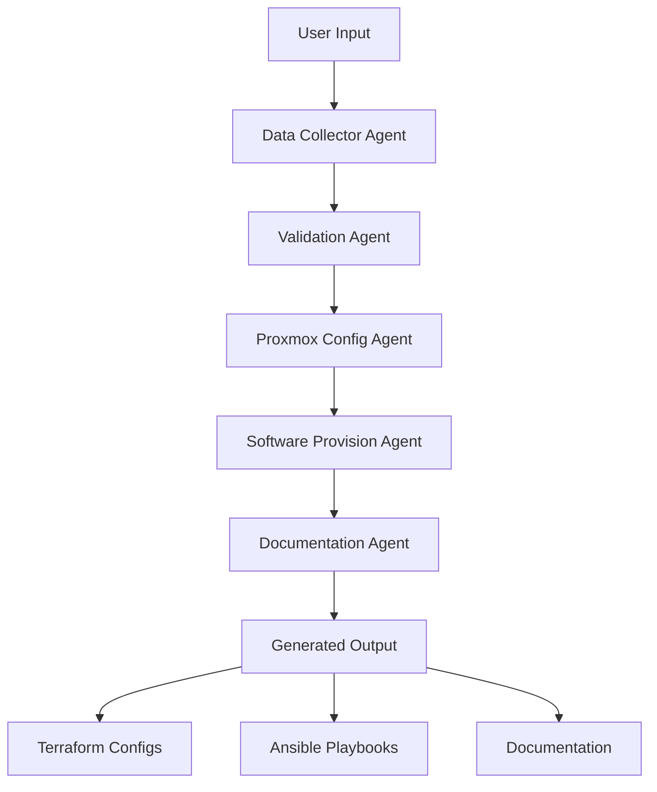

# 🚀 ATLAS - Automated Template-based Logic for Administration Systems

[](https://www.python.org/downloads/)
[](LICENSE)
[](https://github.com/psf/black)
[]()

> **AI-Powered Multi-Agent System for Automated Proxmox VM Provisioning**

ATLAS leverages Microsoft AutoGen's multi-agent architecture to automate the complete lifecycle of virtual machine provisioning on Proxmox environments. Through intelligent conversation flows between specialized AI agents, ATLAS transforms user requirements into production-ready infrastructure.

## 🎯 What ATLAS Does



### Intelligent Workflow
1. **🗣️ Interactive Collection**: Guided conversation to gather VM requirements
2. **✅ Smart Validation**: AI-powered validation of configurations and constraints  
3. **⚙️ Auto-Generation**: Creates Terraform configs, Ansible playbooks, and documentation
4. **📊 Rich Documentation**: Comprehensive setup guides and operational runbooks
5. **🛡️ Safety First**: Dry-run mode and validation before any actual changes

## 🚀 Quick Start

### Installation

```bash
# Clone the repository
git clone https://github.com/ssignori76/ATLAS.git
cd ATLAS

# Install dependencies
pip install -r requirements.txt

# Configure your environment (see Configuration section)
cp .env.example .env
# Edit .env with your Proxmox and LLM credentials
```

### Basic Usage

```bash
# Start the interactive provisioning workflow
python -m atlas.cli provision

# Or use specific commands
python -m atlas.cli validate --config myvm.yaml
python -m atlas.cli generate --output ./infrastructure/
```

### Your First VM

```python
from atlas.core import get_config
from atlas.agents import OrchestrationAgent

# Initialize ATLAS
config = get_config()
orchestrator = OrchestrationAgent(config)

# Start interactive provisioning
result = await orchestrator.provision_vm(
    conversation_mode=True,
    output_dir="./my-infrastructure"
)

print(f"✅ Generated configs in: {result.output_path}")
```

## ✨ Key Features

- **🤖 AI-Driven Conversations**: Natural language interaction for requirement gathering
- **🔧 Multi-Provider Support**: Proxmox VE with extensible architecture  
- **📋 Smart Templates**: Pre-configured templates for common scenarios
- **🛡️ Production Ready**: Comprehensive validation, logging, and error handling
- **📊 Auto Documentation**: Generated runbooks and operational guides
- **� GitOps Ready**: Version-controlled infrastructure as code

## 📋 Configuration

ATLAS supports multiple configuration methods:

### Environment Variables (Recommended)
```bash
# Proxmox Configuration
export ATLAS_PROXMOX_HOST="proxmox.example.com"
export ATLAS_PROXMOX_USER="atlas@pve"
export ATLAS_PROXMOX_PASSWORD="your-password"

# LLM Configuration (supports OpenAI, Azure, Anthropic, Local)
export ATLAS_LLM_PROVIDER="openai"
export ATLAS_LLM_API_KEY="sk-your-api-key"
export ATLAS_LLM_MODEL_NAME="gpt-4"
```

### Configuration File
```yaml
# atlas.yaml
proxmox:
  host: "proxmox.example.com"
  user: "atlas@pve"
  
llm:
  provider: "openai"
  model_name: "gpt-4"
  temperature: 0.7

vm_defaults:
  memory: 2048
  cores: 2
  disk_size: "20G"
```

See the [API Key Management Guide](docs/api-key-management.md) for detailed configuration options.

## 🎮 Example Scenarios

### Web Server Deployment
```bash
atlas provision --template web-server --domain myapp.com
# → Generates: VM + Nginx + SSL + Monitoring
```

### Development Environment
```bash
atlas provision --template dev-stack --languages python,nodejs
# → Generates: VM + Docker + Dev tools + VS Code Server
```

### Database Cluster
```bash
atlas provision --template postgres-ha --replicas 3
# → Generates: 3 VMs + PostgreSQL + Replication + Backup
```

## 📚 Documentation

- **[Complete Documentation](docs/)** - Comprehensive guides and tutorials
- **[API Key Management](docs/api-key-management.md)** - LLM provider configuration
- **[Architecture Overview](docs/architecture.md)** - System design and components
- **[Contributing Guide](CONTRIBUTING.md)** - How to contribute to ATLAS

## 🛠️ Development Status

| Component | Status | Description |
|-----------|--------|-------------|
| **Core Framework** | ✅ Complete | Configuration, logging, data models |
| **LLM Integration** | ✅ Complete | Multi-provider support (OpenAI, Azure, Anthropic) |
| **Agent Framework** | ✅ Complete | Base classes and communication protocols |
| **CLI Interface** | 🚧 In Progress | Command-line interface |
| **Interactive Agents** | 🚧 Next | AutoGen-powered conversation flow |
| **Terraform Generation** | 🚧 Next | Proxmox infrastructure templates |
| **Ansible Integration** | 🚧 Next | Software provisioning playbooks |

## 🤝 Contributing

We welcome contributions! Please see our [Contributing Guide](CONTRIBUTING.md) for details on:

- Setting up the development environment
- Code style and testing guidelines  
- Submitting pull requests
- Community guidelines

## 📄 License

This project is licensed under the MIT License - see the [LICENSE](LICENSE) file for details.

## 🔗 Links

- **Repository**: [https://github.com/ssignori76/ATLAS](https://github.com/ssignori76/ATLAS)
- **Documentation**: [docs/](docs/)
- **Issues**: [GitHub Issues](https://github.com/ssignori76/ATLAS/issues)
- **Changelog**: [CHANGELOG.md](CHANGELOG.md)

---

⭐ **Star this repository** if you find ATLAS useful!
                           └─────────────────┘    └─────────────────┘
```

### Flusso di Lavoro

1. **Interazione Utente**: Conversazione guidata per raccolta parametri
2. **Validazione**: Verifica coerenza e disponibilità risorse
3. **Generazione**: Creazione configurazioni Terraform e Ansible
4. **Documentazione**: Generazione automatica documentazione e diagrammi
5. **Output**: Organizzazione strutturata di tutti i file generati

## 💻 Requisiti di Sistema

### Software
- **Python 3.10+** con pip
- **Terraform 1.0+** (per deployment Proxmox)
- **Ansible 4.0+** (per configurazione VM)
- **Git** (per version control)

### Proxmox VE
- **Proxmox VE 7.0+**
- **API v2+** abilitata
- **Utente** con privilegi sufficienti per:
  - Creare VM
  - Gestire storage
  - Configurare network

### Risorse Minime
- **CPU**: 2 cores
- **RAM**: 4GB
- **Disk**: 10GB spazio libero
- **Network**: Connessione a Proxmox cluster

## 📦 Installazione

### Installazione Rapida

```bash
# Clone repository
git clone https://github.com/ssignori76/ATLAS.git
cd ATLAS

# Setup virtual environment
python -m venv venv
source venv/bin/activate  # Linux/macOS
# venv\Scripts\activate     # Windows

# Install dependencies
pip install -r requirements.txt

# Install development dependencies (opzionale)
pip install -r requirements-dev.txt

# Verify installation
python -m atlas.main --version
```

### Installazione con Docker

```bash
# Build container
docker build -t atlas:latest .

# Run with config volume
docker run -it \
  -v $(pwd)/config:/app/config \
  -v $(pwd)/output:/app/output \
  atlas:latest
```

### Installazione da PyPI (coming soon)

```bash
pip install atlas-proxmox
atlas --version
```

## 🚀 Utilizzo Rapido

### 1. Configurazione Iniziale

```bash
# Copia file di configurazione esempio
cp config.example.yaml config.yaml

# Modifica configurazione per il tuo ambiente
nano config.yaml
```

```yaml
# config.yaml
proxmox:
  host: "proxmox.example.com"
  user: "atlas@pve"
  password: "${PROXMOX_PASSWORD}"  # Usa variabile d'ambiente
  verify_ssl: true

output:
  directory: "./output"
  format: ["terraform", "ansible", "docs"]

logging:
  level: "INFO"
  format: "json"
```

### 2. Avvio Sistema

```bash
# Avvio conversazione guidata
python -m atlas.main

# Oppure con configurazione specifica
python -m atlas.main --config custom-config.yaml

# Modalità dry-run (nessuna modifica)
python -m atlas.main --dry-run

# Modalità verbose per debugging
python -m atlas.main --verbose
```

### 3. Esempio di Conversazione

```
🚀 ATLAS - Automated Template-based Logic for Administration Systems
   Proxmox VM Deployment Assistant

Hello! I'll help you create and configure VMs on your Proxmox cluster.
Let's start by gathering some information...

🔍 How many VMs would you like to create? (1-50): 3

📝 Great! Let's configure each VM:

=== VM 1 Configuration ===
🏷️  Hostname: web-server-01
💾 CPU cores (1-64): 4
🧠 RAM in GB (1-1024): 8
💿 Disk space in GB (10-10240): 100
🗄️  Storage type [local/shared/ssd/hdd]: ssd
🖥️  Operating System:
   1. Ubuntu 20.04 LTS
   2. Ubuntu 22.04 LTS
   3. Debian 11
   4. CentOS 8
   5. RHEL 8
   Choose (1-5): 2

🌐 Network configuration:
   IP assignment [dhcp/static]: static
   IP Address: 192.168.1.100
   Subnet mask: 255.255.255.0
   Gateway: 192.168.1.1
   DNS servers (comma-separated): 8.8.8.8,1.1.1.1

📦 Software to install:
   Available packages:
   1. Nginx
   2. Apache2
   3. Docker
   4. PostgreSQL
   5. MySQL
   6. Node.js
   7. Python
   8. Custom package
   
   Select packages (comma-separated numbers): 1,3,7
   
=== VM 2 Configuration ===
...

✅ Configuration complete! 
📊 Validating resources and configurations...
🔧 Generating Terraform configurations...
📜 Creating Ansible playbooks...
📚 Generating documentation...

🎉 Success! All files generated in: ./output/deployment-2025-07-05-174523/

Next steps:
1. Review generated files in output directory
2. Apply Terraform: cd output/deployment-*/terraform && terraform apply
3. Run Ansible: cd output/deployment-*/ansible && ansible-playbook site.yml
4. Check documentation: open output/deployment-*/docs/README.html
```

## ⚙️ Configurazione

### File di Configurazione

Il sistema supporta configurazioni attraverso:

1. **File YAML** (`config.yaml`)
2. **Variabili d'ambiente** (`ATLAS_*`)
3. **Argomenti CLI** (`--option value`)

Priorità: CLI > ENV > File > Default

### Configurazione Proxmox

```yaml
proxmox:
  host: "proxmox.example.com"
  port: 8006
  user: "atlas@pve"
  password: "${PROXMOX_PASSWORD}"
  token_name: "atlas-token"  # Alternativa a password
  token_value: "${PROXMOX_TOKEN}"
  verify_ssl: true
  timeout: 30
  node: "proxmox-node-01"  # Nodo predefinito
```

### Profili Predefiniti

```yaml
profiles:
  web-server:
    cpu_cores: 2
    memory_gb: 4
    disk_gb: 50
    software: ["nginx", "certbot", "ufw"]
    
  database-server:
    cpu_cores: 4
    memory_gb: 8
    disk_gb: 200
    software: ["postgresql", "pgadmin", "backup-tools"]
    
  development:
    cpu_cores: 2
    memory_gb: 4
    disk_gb: 100
    software: ["docker", "git", "nodejs", "python"]
```

### Template Personalizzati

```yaml
templates:
  terraform:
    provider_version: "~> 2.9"
    default_pool: "local-lvm"
    
  ansible:
    python_interpreter: "/usr/bin/python3"
    become_method: "sudo"
    gather_facts: true
```

## 📖 Esempi d'Uso

### Scenario 1: Ambiente di Sviluppo

```bash
# Configurazione rapida per 3 VM di sviluppo
python -m atlas.main --profile development --count 3
```

### Scenario 2: Cluster Web + Database

```bash
# Deployment specifico con configurazione custom
python -m atlas.main --config web-cluster.yaml
```

### Scenario 3: Deployment Produzione

```bash
# Modalità production con validazioni extra
python -m atlas.main --env production --validate-strict
```

## 🛠️ Sviluppo

### Setup Ambiente di Sviluppo

```bash
# Clone repository
git clone https://github.com/ssignori76/ATLAS.git
cd ATLAS

# Create development environment
python -m venv venv-dev
source venv-dev/bin/activate

# Install development dependencies
pip install -r requirements-dev.txt

# Install pre-commit hooks
pre-commit install

# Run tests
pytest

# Run with coverage
pytest --cov=atlas --cov-report=html

# Type checking
mypy atlas/

# Linting
pylint atlas/

# Formatting
black atlas/
isort atlas/
```

### Struttura del Progetto

```
atlas/
├── agents/                 # Agenti AI specializzati
│   ├── __init__.py
│   ├── base.py            # Classe base per agenti
│   ├── data_collector.py  # Raccolta dati utente
│   ├── validator.py       # Validazione input
│   ├── proxmox_config.py  # Configurazione Proxmox
│   ├── software_provision.py # Provisioning software
│   ├── documentation.py   # Generazione docs
│   └── orchestrator.py    # Orchestrazione workflow
├── models/                 # Data models (Pydantic)
│   ├── __init__.py
│   ├── vm_spec.py         # Specifica VM
│   ├── network.py         # Configurazione rete
│   ├── software.py        # Pacchetti software
│   └── deployment.py      # Configurazione deployment
├── generators/             # Generatori configurazioni
│   ├── __init__.py
│   ├── terraform/         # Generazione Terraform
│   ├── ansible/           # Generazione Ansible
│   └── docs/              # Generazione documentazione
├── utils/                  # Utilità condivise
│   ├── __init__.py
│   ├── validators.py      # Validatori input
│   ├── helpers.py         # Funzioni helper
│   ├── logging.py         # Sistema logging
│   └── config.py          # Gestione configurazione
├── templates/              # Template Jinja2
│   ├── terraform/
│   ├── ansible/
│   └── docs/
├── tests/                  # Test suite
│   ├── unit/
│   ├── integration/
│   ├── fixtures/
│   └── conftest.py
├── config/                 # Configurazioni
│   ├── schemas/           # JSON Schema
│   ├── profiles/          # Profili predefiniti
│   └── templates/         # Template custom
├── docs/                   # Documentazione
│   ├── requirements/      # Documenti requisiti
│   ├── api/              # Documentazione API
│   ├── examples/         # Esempi d'uso
│   └── troubleshooting/  # Risoluzione problemi
├── scripts/               # Script utility
├── main.py               # Entry point principale
├── __init__.py
└── version.py            # Versioning
```

### Contributing

1. **Fork** il repository
2. **Create** feature branch (`git checkout -b feature/amazing-feature`)
3. **Commit** le modifiche (`git commit -m 'Add amazing feature'`)
4. **Push** al branch (`git push origin feature/amazing-feature`)
5. **Create** Pull Request

### Standards di Codice

- **Python 3.10+** con type hints
- **Black** per formatting
- **Pylint** per linting
- **MyPy** per type checking
- **pytest** per testing
- **Conventional Commits** per messaggi commit

## 📚 Documentazione

### Documentazione Completa

- **[Guida Utente](docs/user-guide.md)** - Tutorial completo
- **[API Reference](docs/api/)** - Documentazione API
- **[Esempi](docs/examples/)** - Esempi pratici
- **[Troubleshooting](docs/troubleshooting.md)** - Risoluzione problemi
- **[FAQ](docs/faq.md)** - Domande frequenti

### Guide Specifiche

- **[Configurazione Proxmox](docs/proxmox-setup.md)**
- **[Template Personalizzati](docs/custom-templates.md)**
- **[Plugin Development](docs/plugin-development.md)**
- **[Security Best Practices](docs/security.md)**

## 🤝 Contribuire

Contributi sono benvenuti! Leggi la [Guida ai Contributi](CONTRIBUTING.md) per dettagli su:

- Come fare il setup dell'ambiente di sviluppo
- Standards di codice e testing
- Process per pull request
- Code of conduct

### Roadmap

- [ ] **v1.0** - MVP con funzionalità core
- [ ] **v1.1** - Plugin system e template engine
- [ ] **v1.2** - Web interface (opzionale)
- [ ] **v2.0** - Multi-cloud support
- [ ] **v2.1** - Enterprise features (RBAC, audit)

## 📄 Licenza

Questo progetto è rilasciato sotto licenza **MIT**. Vedi il file [LICENSE](LICENSE) per dettagli.

## 🆘 Supporto

- **Issues**: [GitHub Issues](https://github.com/ssignori76/ATLAS/issues)
- **Discussions**: [GitHub Discussions](https://github.com/ssignori76/ATLAS/discussions)
- **Wiki**: [Project Wiki](https://github.com/ssignori76/ATLAS/wiki)

## 🙏 Riconoscimenti

- **Microsoft AutoGen** - Framework per agenti AI
- **Proxmox VE** - Piattaforma virtualizzazione
- **HashiCorp Terraform** - Infrastructure as Code
- **Red Hat Ansible** - Configuration Management

---

**Creato con ❤️ per automatizzare l'infrastruttura Proxmox**

[](https://github.com/ssignori76/ATLAS/actions)
[](https://codecov.io/gh/ssignori76/ATLAS)
[](https://github.com/psf/black)
[](https://opensource.org/licenses/MIT)
