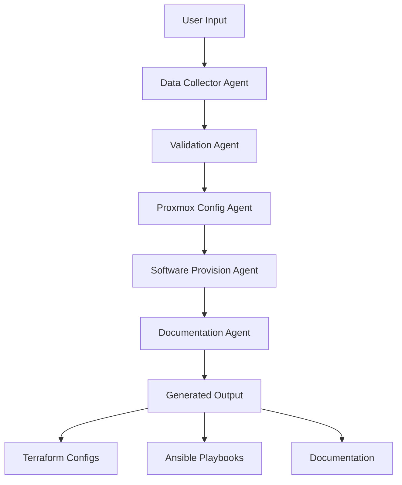

# 🚀 ATLAS - Automated Template-based Logic for Administration Systems

[](https://www.python.org/downloads/)
[](LICENSE)
[](https://github.com/psf/black)
[](http://mypy-lang.org/)
[]()

> **AI-Powered Multi-Agent System for Automated Proxmox VM Provisioning**

ATLAS leverages Microsoft AutoGen's multi-agent architecture to automate the complete lifecycle of virtual machine provisioning on Proxmox environments. Through intelligent conversation flows between specialized AI agents, ATLAS transforms user requirements into production-ready infrastructure.

## 🎯 **Current Status: MVP Foundation Complete**

✅ **Phase 1 Complete**: Full MVP infrastructure implemented  
🚧 **Phase 2 In Progress**: AutoGen agents implementation  
📋 **Next**: Interactive provisioning workflow  

---

## 🌟 **What ATLAS Does**



### **Intelligent Workflow**
1. **🗣️ Interactive Collection**: Guided conversation to gather VM requirements
2. **✅ Smart Validation**: AI-powered validation of configurations and constraints  
3. **⚙️ Auto-Generation**: Creates Terraform configs, Ansible playbooks, and documentation
4. **📊 Rich Documentation**: Comprehensive setup guides and operational runbooks
5. **🛡️ Safety First**: Dry-run mode and validation before any actual changes

---

## 🚀 **Quick Start**

### **Installation**

```bash
# Clone the repository
git clone https://github.com/ssignori76/ATLAS.git
cd ATLAS

# Install in development mode
pip install -e .

# Or install specific feature sets
pip install -e ".[vault,terraform,ansible]"
```

### **Initial Setup**

```bash
# Create configuration file
atlas init

# Edit configuration with your settings
vi atlas.yaml

# Validate configuration
atlas validate

# Check system status
atlas status
```

### **Basic Usage**

```bash
# Start interactive provisioning
atlas provision

# Use configuration file
atlas provision --config-file my-vms.yaml

# Dry run mode (recommended first)
atlas --dry-run provision

# Debug mode for troubleshooting
atlas --debug --verbose provision
```

---

## 🏗️ **Architecture Overview**

### **Multi-Agent System**

```
┌─────────────────────────────────────────────────────────────┐
│                    ATLAS ORCHESTRATOR                      │
├─────────────────────────────────────────────────────────────┤
│  📊 Data Collector  │  ✅ Validator    │  ⚙️ Proxmox Config │
│  🔧 Software Setup  │  📚 Docs Generator │  🎭 Orchestrator  │
└─────────────────────────────────────────────────────────────┘
                              │
                    ┌─────────┴─────────┐
                    │                   │
              ┌─────▼─────┐       ┌─────▼─────┐
              │ Proxmox   │       │ Generated │
              │ Cluster   │       │ Artifacts │
              └───────────┘       └───────────┘
```

### **Core Components**

| Component | Purpose | Status |
|-----------|---------|--------|
| **CLI Interface** | User interaction and command orchestration | ✅ Complete |
| **Configuration System** | Multi-source config with validation | ✅ Complete |
| **Error Handling** | Structured exceptions and debugging | ✅ Complete |
| **Agent Framework** | AutoGen agent foundation | ✅ Ready |
| **Data Collector Agent** | Interactive parameter gathering | 🚧 Next |
| **Validation Agent** | Input and constraint validation | 🚧 Next |
| **Proxmox Config Agent** | Terraform generation | 🚧 Next |
| **Software Provision Agent** | Ansible playbook creation | 🚧 Next |
| **Documentation Agent** | Auto-documentation generation | 🚧 Next |

---

## 📋 **Configuration**

### **Configuration File (atlas.yaml)**

```yaml
# Proxmox Connection
proxmox:
  host: "proxmox.example.com"
  port: 8006
  user: "atlas@pve"
  password: "your-password"  # Or use API tokens
  verify_ssl: true

# AI Agent Configuration  
agents:
  model: "gpt-4"
  api_key: "your-openai-key"
  temperature: 0.1
  max_tokens: 2000

# Security Settings
security:
  vault_enabled: false
  encrypt_configs: true

# Output Configuration
output:
  base_path: "./output"
  terraform_enabled: true
  ansible_enabled: true
  documentation_enabled: true

# Runtime Options
runtime:
  debug: false
  dry_run: false
  verbose: false
```

### **Environment Variables**

```bash
# Proxmox Connection
export ATLAS_PROXMOX_HOST="proxmox.example.com"
export ATLAS_PROXMOX_USER="atlas@pve"
export ATLAS_PROXMOX_PASSWORD="your-password"

# Agent Configuration
export ATLAS_AGENT_API_KEY="your-openai-key"
export ATLAS_AGENT_MODEL="gpt-4"

# Runtime Flags
export ATLAS_DEBUG="true"
export ATLAS_DRY_RUN="true"
```

---

## 🎮 **Usage Examples**

### **Interactive Session**

```bash
$ atlas provision

  ▄▄▄  ▄▄▄▄▄▄▄▄▄▄▄ ATLAS ▄▄▄▄▄▄▄▄▄▄▄  ▄▄▄  
  Automated Template-based Logic for Administration Systems
  AI-Powered Proxmox VM Provisioning

Starting ATLAS provisioning workflow...

🤖 Data Collector Agent: Hello! I'll help you configure your VMs.
    How many VMs would you like to create? [1-10]: 2

🤖 Data Collector Agent: Great! Let's configure VM #1:
    What hostname would you like? vm-web-01
    How many CPU cores? [1-64]: 4
    How much RAM (MB)? [512-65536]: 8192
    Disk size (GB)? [10-1000]: 100
    Operating System? [ubuntu22, ubuntu20, centos8, debian11]: ubuntu22

✅ Validation Agent: Configuration looks good! Moving to VM #2...

📊 Generated Output:
   ├── terraform/
   │   ├── main.tf
   │   ├── variables.tf
   │   └── outputs.tf
   ├── ansible/
   │   ├── inventory.yml
   │   ├── site.yml
   │   └── roles/
   └── docs/
       ├── README.md
       ├── vm-inventory.md
       └── deployment-guide.md

✅ Provisioning completed successfully!
   Output generated in: ./output/2025-07-05_14-30-45
```

### **Configuration File Mode**

```yaml
# vm-config.yaml
vms:
  - hostname: "web-server-01"
    cpu: 4
    memory: 8192
    disk: 100
    os: "ubuntu22"
    software:
      - nginx
      - docker
      - monitoring-agent
      
  - hostname: "db-server-01"  
    cpu: 8
    memory: 16384
    disk: 500
    os: "ubuntu22"
    software:
      - postgresql
      - backup-tools
```

```bash
atlas provision --config-file vm-config.yaml
```

---

## 🛠️ **Development**

### **Development Setup**

```bash
# Clone and setup development environment
git clone https://github.com/ssignori76/ATLAS.git
cd ATLAS

# Install with development dependencies
pip install -e ".[dev]"

# Setup pre-commit hooks
pre-commit install

# Run tests
pytest

# Code formatting and linting
black atlas/
pylint atlas/
mypy atlas/
```

### **Project Structure**

```
ATLAS/
├── atlas/                      # 📦 Main package
│   ├── __init__.py            
│   ├── cli.py                 # 🖥️ Command line interface
│   ├── core/                  # 🔧 Core functionality
│   │   ├── config.py          # ⚙️ Configuration management
│   │   ├── exceptions.py      # ❌ Error handling
│   │   └── proxmox.py         # 🔌 Proxmox integration
│   ├── agents/                # 🤖 AutoGen agents
│   │   ├── base.py           # 📋 Base agent class
│   │   ├── data_collector.py # 📊 Parameter collection
│   │   ├── validator.py      # ✅ Validation logic
│   │   ├── proxmox_config.py # ⚙️ Config generation
│   │   ├── software_provision.py # 🔧 Software setup
│   │   ├── documentation.py  # 📚 Doc generation
│   │   └── orchestrator.py   # 🎭 Workflow orchestration
│   ├── generators/            # 🏭 Code generators
│   │   ├── terraform.py      # 🏗️ Terraform configs
│   │   ├── ansible.py        # 📋 Ansible playbooks
│   │   └── documentation.py  # 📖 Documentation
│   └── utils/                 # 🛠️ Utilities
├── tests/                     # 🧪 Test suite
├── docs/                      # 📚 Documentation
├── examples/                  # 💡 Example configurations
├── pyproject.toml            # 📋 Project configuration
├── requirements.txt          # 📦 Dependencies
└── README.md                 # 📖 This file
```

### **Testing**

```bash
# Run all tests
pytest

# Run with coverage
pytest --cov=atlas --cov-report=html

# Run specific test categories
pytest -m unit          # Unit tests only
pytest -m integration   # Integration tests only
pytest -m e2e           # End-to-end tests only

# Run tests with output
pytest -v -s
```

### **Code Quality**

```bash
# Format code
black atlas/ tests/

# Check code quality
pylint atlas/

# Type checking
mypy atlas/

# Security scanning
bandit -r atlas/

# Run all quality checks
pre-commit run --all-files
```

---

## 🔒 **Security**

### **Credential Management**

- **HashiCorp Vault**: Optional integration for secret management
- **Environment Variables**: Secure credential injection
- **File Encryption**: Local configuration encryption
- **API Tokens**: Proxmox API token support instead of passwords

### **Safety Features**

- **Dry Run Mode**: Test configurations without making changes
- **Validation**: Multi-layer validation before execution
- **Audit Trail**: Complete logging of all operations
- **Permission Checks**: Proxmox permission validation

---

## 📊 **Current Implementation Status**

| Feature | Status | Description |
|---------|--------|-------------|
| 🖥️ **CLI Interface** | ✅ Complete | Full command-line interface with Rich UI |
| ⚙️ **Configuration** | ✅ Complete | Multi-source config with validation |
| ❌ **Error Handling** | ✅ Complete | Structured exception hierarchy |
| 📦 **Packaging** | ✅ Complete | Modern Python packaging setup |
| 🧪 **Testing Framework** | ✅ Complete | Pytest configuration with coverage |
| 🛠️ **Development Tools** | ✅ Complete | Linting, formatting, type checking |
| 🤖 **Agent Framework** | ✅ Ready | Foundation for AutoGen agents |
| 🔌 **Proxmox Integration** | 🚧 Next | API client and operations |
| 📊 **Data Collection** | 🚧 Next | Interactive parameter gathering |
| ✅ **Validation Engine** | 🚧 Next | Input and constraint validation |
| 🏗️ **Terraform Generation** | 🚧 Next | Infrastructure as Code |
| 📋 **Ansible Playbooks** | 🚧 Next | Software provisioning |
| 📚 **Documentation Gen** | 🚧 Next | Auto-generated documentation |

---

## 🚀 **Roadmap**

### **🎯 Phase 2: Core Agents (Current)**
- [ ] Implement BaseAgent class with AutoGen integration
- [ ] DataCollectorAgent for interactive parameter gathering
- [ ] ValidationAgent for input validation and constraint checking
- [ ] ProxmoxConfigAgent for Terraform configuration generation

### **🎯 Phase 3: Advanced Features**
- [ ] SoftwareProvisionAgent for Ansible playbook generation
- [ ] DocumentationAgent for comprehensive documentation
- [ ] OrchestratorAgent for workflow coordination
- [ ] Proxmox API integration and testing

### **🎯 Phase 4: Enterprise Features**
- [ ] HashiCorp Vault integration
- [ ] Multi-cluster support
- [ ] Advanced networking configurations
- [ ] High availability setups
- [ ] Monitoring and alerting integration

---

## 🤝 **Contributing**

We welcome contributions! Please see our [Contributing Guide](CONTRIBUTING.md) for details.

### **Development Workflow**

1. **Fork** the repository
2. **Create** a feature branch: `git checkout -b feature-name`
3. **Commit** changes: `git commit -m "feat: add new feature"`
4. **Push** to branch: `git push origin feature-name`
5. **Create** a Pull Request

### **Contribution Areas**

- 🤖 **Agent Development**: Implement new AutoGen agents
- 🔌 **Integrations**: Add support for other hypervisors or cloud providers
- 🧪 **Testing**: Improve test coverage and add integration tests
- 📚 **Documentation**: Enhance documentation and examples
- 🐛 **Bug Fixes**: Fix issues and improve reliability

---

## 📄 **License**

This project is licensed under the MIT License - see the [LICENSE](LICENSE) file for details.

---

## 📞 **Support**

- **Issues**: [GitHub Issues](https://github.com/ssignori76/ATLAS/issues)
- **Discussions**: [GitHub Discussions](https://github.com/ssignori76/ATLAS/discussions)
- **Documentation**: [docs/](docs/)

---

## 🙏 **Acknowledgments**

- **Microsoft AutoGen**: For the amazing multi-agent framework
- **Proxmox**: For the robust virtualization platform
- **OpenAI**: For the powerful language models
- **Community**: For feedback, contributions, and support

---

**⭐ If you find ATLAS useful, please star the repository!**

*Built with ❤️ by the ATLAS development team*
